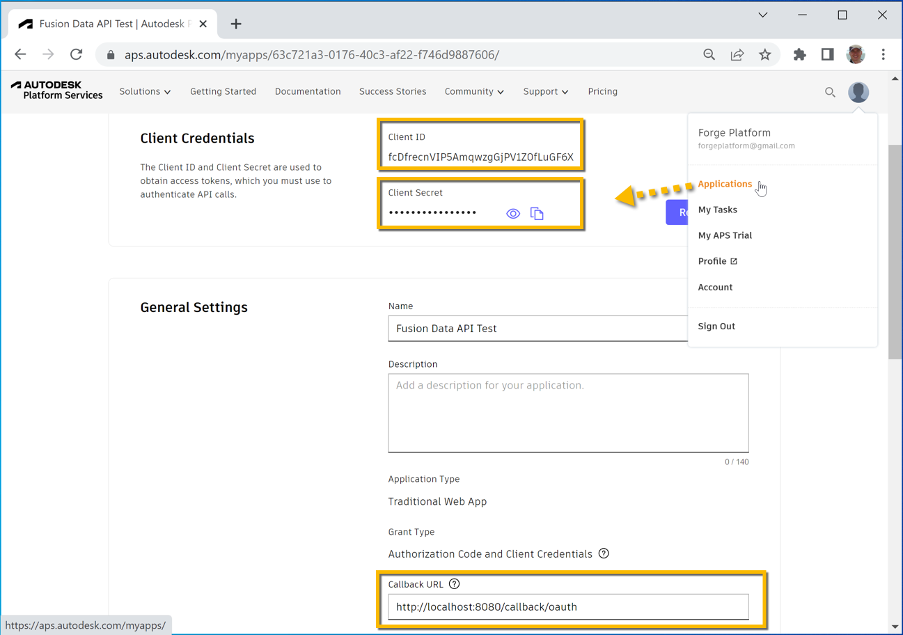

# Get Physical properties for Component

## Setting up your test
In the **terminal** run this to install all the necessary components
```
npm i
``` 

You will need to set the value of `clientId` and `clientSecret` variables in `index.js` based on your **APS app**'s credentials and make sure that the `Callback URL` of the app is set to `http://localhost:8080/callback/oauth` as shown in the picture\


You will also need to set the value of `hubName`, `projectName` and `componentName` variables. You can find them either in **Fusion Teams** web app, in **Fusion 360** or any other place that lets you navigate the contents of your **Autodesk** hubs and projects - including the **Fusion Data API** itself\


## Running the test
In a **terminal**, you can run the test with:
```
npm start
```
As instructed in the console, you'll need to open a web browser and navigate to http://localhost:8080 in order to log into your Autodesk account 

## Output
```
Open http://localhost:8080 in a web browser in order to log in with your Autodesk account!
Physical properties:
area: 819.4486552856862 [Square centimeters]
volume: 848.945652239262 [Cubic centimeters]
mass: 6.664223370078205 [Kilograms]
density: 0.00785 [Cubic centimeters]
boundingBox:
  length: 11.2966 [Centimeters]
  height: 36.50386108368127 [Centimeters]
  width: 21.439766566807783 [Centimeters]
```

## Workflow explanation

The workflow can be achieved following these steps:

1. Ask for the physical properties of a specific model based on its hub, project and component name
2. If it's not available yet (status is not "COMPLETED") then keep checking the latest status
3. Once the status is "COMPLETED" you can print the physical properties of the component

## Fusion Data API Query

In `app.js` file, the following GraphQL query traverses the hub, project and its rootfolder to get the physycal properties of a given component
```
query GetPhysicalProperties($hubName: String!, $projectName: String!, $componentName: String!) {
  hubs(filter:{name:$hubName}) {
    results {
      projects(filter:{name:$projectName}) {
        results {
          rootFolder {
            items(filter:{name:$componentName}) {
              results {
                ... on Component {
                  tipVersion {
                    physicalProperties {
                      status
                      area {
                        displayValue
                        propertyDefinition {
                            units {
                              name
                            }
                          }
                      }
                      volume {
                        displayValue
                        propertyDefinition {
                            units {
                              name
                            }
                          }
                      }
                      mass {
                        displayValue
                        value
                        propertyDefinition {
                            units {
                              name
                            }
                          }
                      }
                      density {
                        displayValue
                        propertyDefinition {
                            units {
                              name
                            }
                          }
                      }
                      boundingBox {
                        length {
                          displayValue
                          propertyDefinition {
                            units {
                              name
                            }
                          }
                        }
                        height {
                          displayValue
                          propertyDefinition {
                            units {
                              name
                            }
                          }
                        }
                        width {
                          displayValue
                          propertyDefinition {
                            units {
                              name
                            }
                          }
                        }
                      }
                    }       
                  }
                }
              }
            }
          }
        }
      }
    }
  }
}
```

-----------

Please refer to this page for more details: [Fusion Data API Docs](https://aps.autodesk.com/en/docs/fusiondata/v1/developers_guide/overview/)